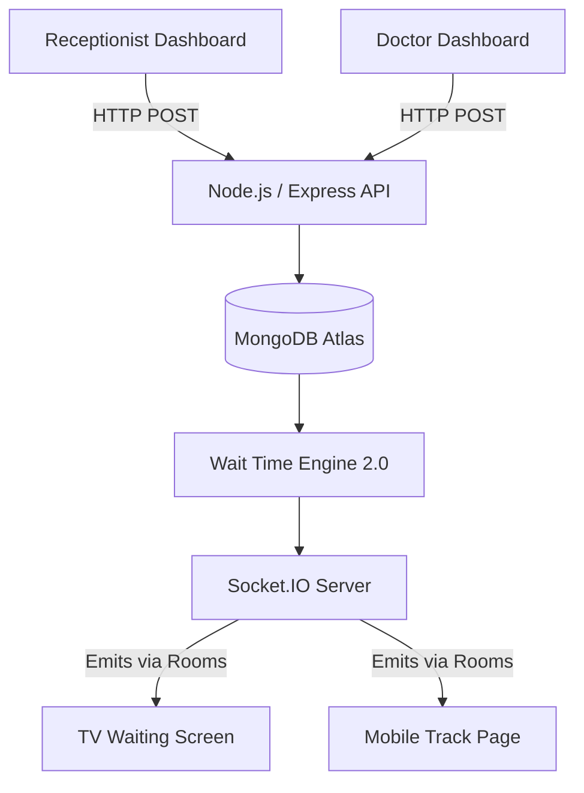

  <h1 align="center">QueueCure</h1>
  <p align="center">
    <strong>"Know your turn before it's your turn."</strong>
  </p>

  <p align="center">
    
    
    
    
    
  </p>
</div>

<br />

## 🎯 The Problem

In neighborhood clinics globally, the patient experience is broken. The reliance on physical paper tokens and manual reception management leads to:

- **Queue Anxiety**: Patients sit in crowded, contagious rooms for hours not knowing when their turn is.
- **Reception Overload**: Clinic staff spend 50% of their time answering "How much longer?"
- **Doctor Inefficiency**: Doctors wait idle when patients step out and miss their verbal call.

## 💡 The Solution

**QueueCure** is a production-grade, highly-scalable, real-time healthcare queue management platform. Built to support multi-clinic SaaS architecture, it empowers clinics with predictive wait-time AI, priority sorting, and mobile-first patient tracking.

---

## ✨ Features

- 🧠 **Predictive Wait Time Engine 2.0**: Calculates exact estimates using rolling historical averages and the specific elapsed time of the *current ongoing* consultation.
- ⚡ **Smart Queue Intelligence**: Actively monitors doctor speed against historical benchmarks (e.g., *"Doctor is running 18% faster today"*).
- 🚑 **Priority Queue System**: Emergency cases bypass Normal cases instantly at the database layer.
- 📱 **QR Code Mobile Tracking**: Patients scan a QR code at reception to track their live position on their phones from a nearby coffee shop.
- 📊 **Analytics Dashboard**: Comprehensive charts (via Recharts) for monitoring clinic efficiency, peak hours, and wait time extremes.
- 🛡️ **Offline Resilience**: If the clinic's Wi-Fi drops, the Socket connection cleanly falls back to REST API polling until the network restores.
- 🔄 **Event Sourcing**: Every action generates an immutable `QueueEvent` log for future auditing and AI modeling.

---

## 🏗️ System Architecture

QueueCure operates on a separated frontend/backend architecture designed for massive concurrency.



*For an in-depth breakdown, see the [Architecture Guide](./docs/architecture.md).*

---

## 📸 Screenshots

*(Screenshots can be found in the `screenshots/` directory)*

- **Reception Dashboard**: Instantly generate tokens, assign priorities, and overview the clinic.
- **Doctor Workspace**: A live timer that dynamically turns from green to red based on efficiency targets.
- **TV Display**: Sleek, Framer-Motion animated TV screen for the waiting room.
- **Mobile Tracker**: An isolated, auto-updating view for individual patients.

---

## 🚀 Installation & Local Setup

QueueCure uses an in-memory MongoDB server for development, so **no external database setup is required** to run it locally!

### 1. Start the Backend API
```bash
cd backend
npm install
npm run dev
```
*Server runs on `http://localhost:3001`*

### 2. Start the Frontend
In a new terminal window:
```bash
cd frontend
npm install
npm run dev
```
*App runs on `http://localhost:3000`*

---

## 🌐 Environment Variables

### Backend (`backend/.env`)
```env
PORT=3001
MONGODB_URI=mongodb+srv://... # Optional. Defaults to in-memory DB if omitted.
```

### Frontend (`frontend/.env.local`)
```env
NEXT_PUBLIC_API_URL=http://localhost:3001
NEXT_PUBLIC_CLINIC_ID= # Optional. Defaults to the primary clinic.
```

---

## 📚 Documentation

For complete technical specifications, review our documentation:

- 🏗️ [Architecture & System Design](./docs/architecture.md)
- 🔌 [API Reference](./docs/api-reference.md)
- 🚀 [Deployment Guide](./docs/deployment-guide.md)
- 🧠 [Thought Process & Tradeoffs](./docs/thought-process.pdf)

---

## 🐳 Docker Deployment

To deploy QueueCure using Docker Compose:

```bash
docker-compose up --build -d
```

---

## 🤝 Contributors

- **Aaditya Sattawan** ([@Tiku57](https://github.com/Tiku57)) - Lead Engineer & Architect

---

## 📄 License

This project is licensed under the MIT License - see the [LICENSE](LICENSE) file for details.
