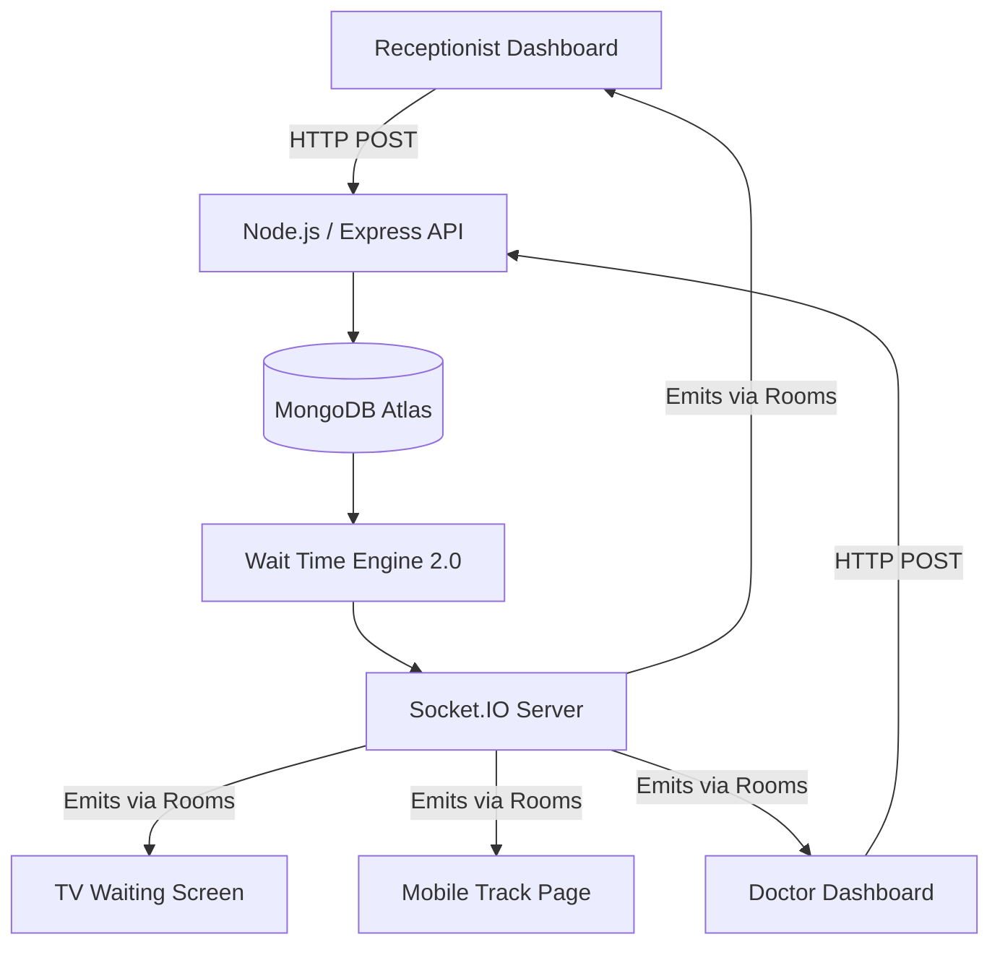
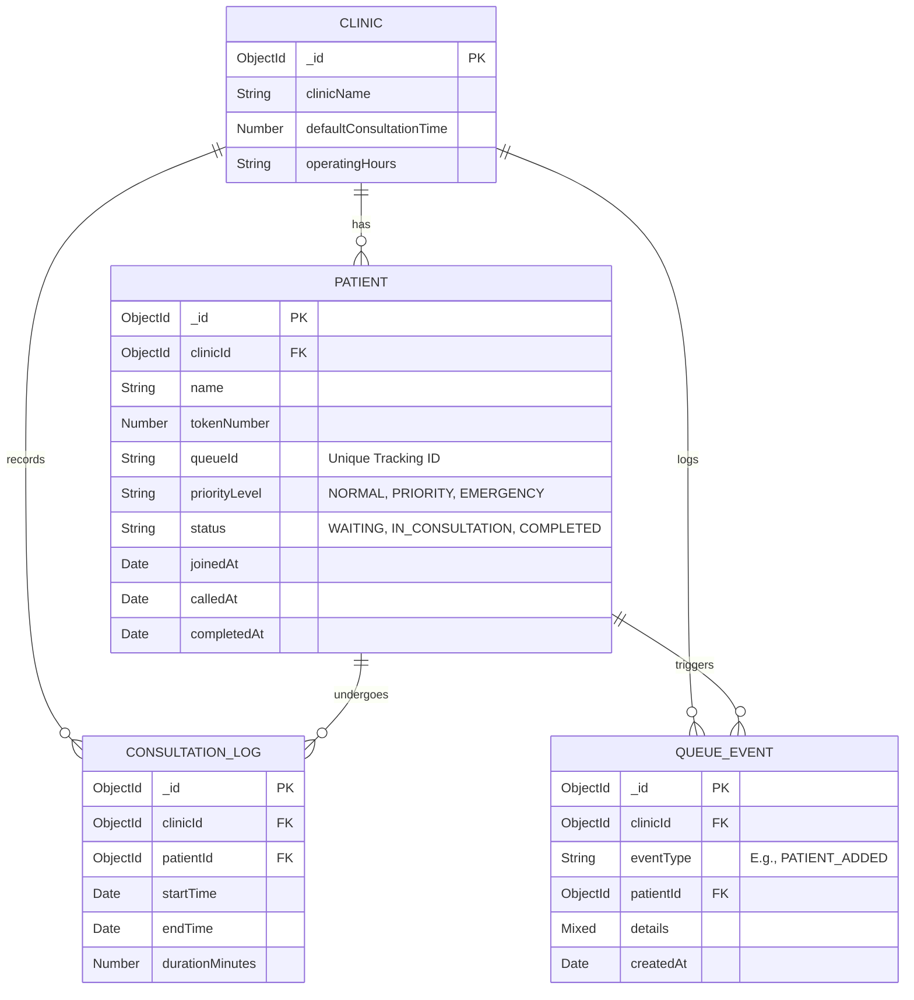

# QueueCure V2 - System Architecture

This document describes the high-level architecture, components, and data flow of QueueCure V2.

## High-Level Design

QueueCure operates on a separated frontend/backend architecture designed for massive concurrency, high availability, and real-time state synchronization across thousands of clinic locations.

## Entity Relationship Diagram (ERD)

The database is structured to support multi-tenancy, rapid queue queries, and robust event sourcing for auditing.

## Core Architectural Components

### 1. Wait Time Engine 2.0
Unlike V1, which used a static average, V2 uses a predictive model factoring in the *elapsed time of the current ongoing consultation*.
**Formula**: `EWT = Max(0, RollingAvg - ElapsedCurrent) + ((PatientsAhead) * RollingAvg)`.
This guarantees that if the doctor is currently 15 minutes into a consultation and usually takes 10 minutes, the queue adapts and recognizes the current patient is delayed, pushing back all subsequent wait times.

### 2. Multi-Clinic Tenancy & Rooms
The application routes data specifically by `clinicId`. The REST API extracts the `clinicId` from headers, and Socket.IO uses `socket.join(clinicId)`. This prevents Clinic A from receiving Clinic B's queue updates, allowing horizontal scaling using Redis Adapters in the future.

### 3. Event Sourcing
Every state mutation creates a `QueueEvent`. This decoupling allows future microservices (e.g., an Analytics service) to consume the event log and replay queue history for deep insights or debugging.

### 4. Offline Recovery Strategy
The Zustand store tracks connection status. If the WebSocket drops, the frontend automatically falls back to HTTP Polling (`setInterval`) every 10 seconds. When the socket restores, it executes an immediate REST sync to guarantee no missed events.
