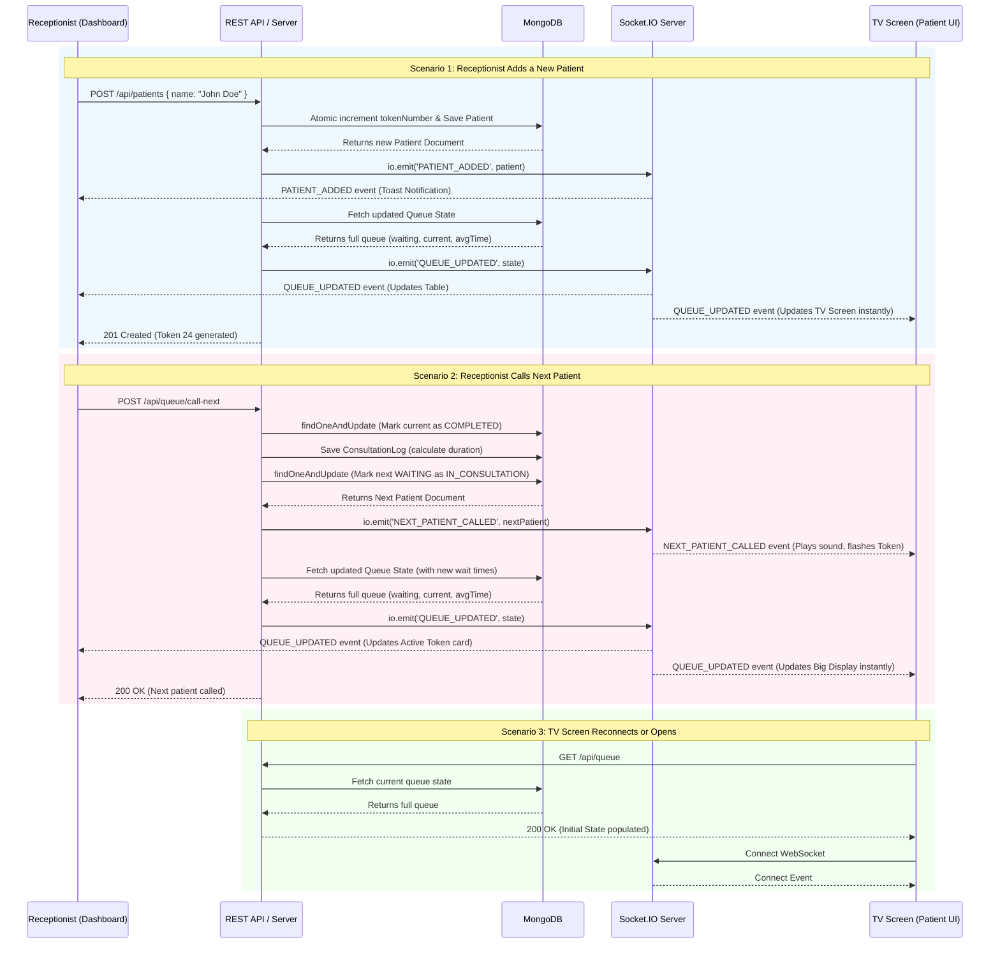

# QueueCure - Socket Event Diagram

Below is the Mermaid sequence diagram representing the real-time event architecture for the QueueCure application.

```mermaid
sequenceDiagram
    participant R as Receptionist (Dashboard)
    participant API as REST API / Server
    participant DB as MongoDB
    participant S as Socket.IO Server
    participant T as TV Screen (Patient UI)

    %% Scenario 1: Adding a Patient
    rect rgb(240, 248, 255)
    Note over R, T: Scenario 1: Receptionist Adds a New Patient
    R->>API: POST /api/patients { name: "John Doe" }
    API->>DB: Atomic increment tokenNumber & Save Patient
    DB-->>API: Returns new Patient Document
    API->>S: io.emit('PATIENT_ADDED', patient)
    S-->>R: PATIENT_ADDED event (Toast Notification)
    
    API->>DB: Fetch updated Queue State
    DB-->>API: Returns full queue (waiting, current, avgTime)
    API->>S: io.emit('QUEUE_UPDATED', state)
    S-->>R: QUEUE_UPDATED event (Updates Table)
    S-->>T: QUEUE_UPDATED event (Updates TV Screen instantly)
    API-->>R: 201 Created (Token 24 generated)
    end

    %% Scenario 2: Calling Next Patient
    rect rgb(255, 240, 245)
    Note over R, T: Scenario 2: Receptionist Calls Next Patient
    R->>API: POST /api/queue/call-next
    API->>DB: findOneAndUpdate (Mark current as COMPLETED)
    API->>DB: Save ConsultationLog (calculate duration)
    API->>DB: findOneAndUpdate (Mark next WAITING as IN_CONSULTATION)
    DB-->>API: Returns Next Patient Document
    API->>S: io.emit('NEXT_PATIENT_CALLED', nextPatient)
    S-->>T: NEXT_PATIENT_CALLED event (Plays sound, flashes Token)
    
    API->>DB: Fetch updated Queue State (with new wait times)
    DB-->>API: Returns full queue (waiting, current, avgTime)
    API->>S: io.emit('QUEUE_UPDATED', state)
    S-->>R: QUEUE_UPDATED event (Updates Active Token card)
    S-->>T: QUEUE_UPDATED event (Updates Big Display instantly)
    API-->>R: 200 OK (Next patient called)
    end

    %% Scenario 3: New Client Connecting
    rect rgb(240, 255, 240)
    Note over T, API: Scenario 3: TV Screen Reconnects or Opens
    T->>API: GET /api/queue
    API->>DB: Fetch current queue state
    DB-->>API: Returns full queue
    API-->>T: 200 OK (Initial State populated)
    T->>S: Connect WebSocket
    S-->>T: Connect Event
    end
```
